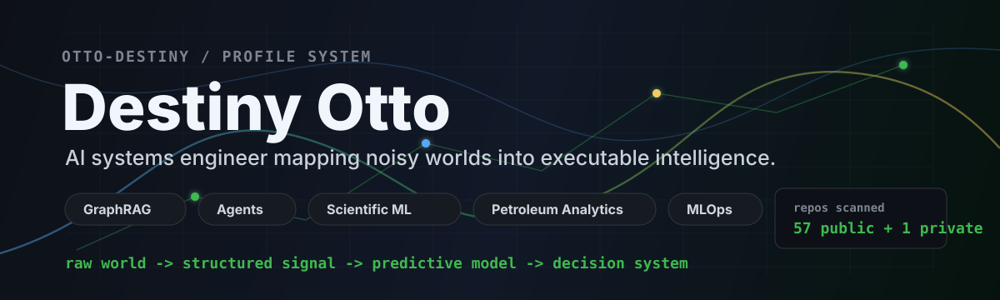
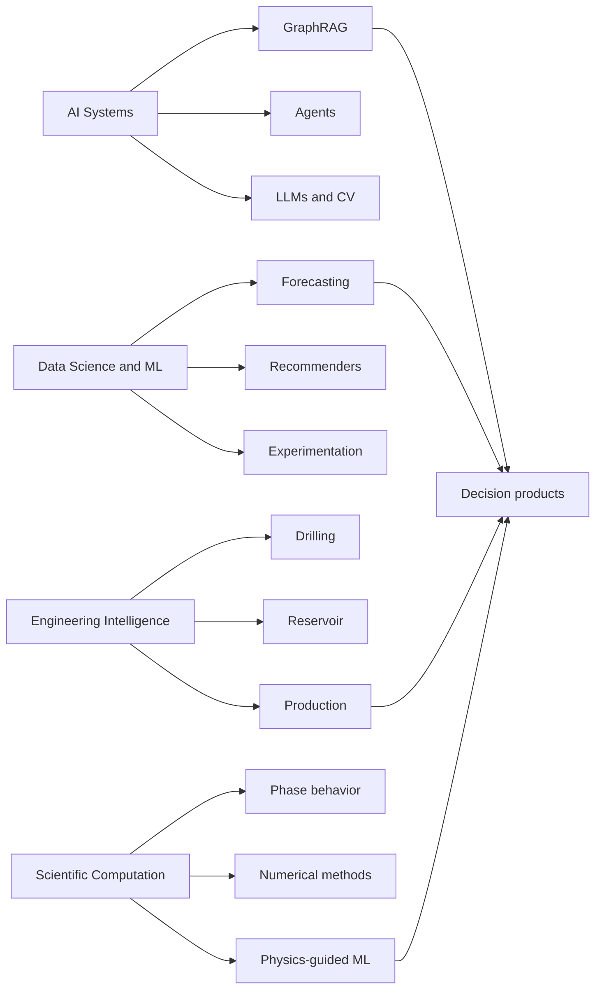

<!--
Profile source of truth:
- profile_projects.yml keeps the project taxonomy maintainable.
- PROJECT_ATLAS.md keeps the complete repository inventory out of the main first impression.
-->

<p align="center">
  <a href="https://github.com/Otto-Destiny?tab=repositories"></a>
  <a href="https://www.linkedin.com/in/destiny-otto"></a>
  <a href="mailto:Destinymanuchi.otto@gmail.com"></a>
</p>

## I build machines that think near the metal

I am Destiny Otto, an AI and Machine Learning Engineer working at the intersection of intelligent systems, scientific computation, and engineering reality. My favorite problems are the messy ones: noisy sensors, fractured documents, volatile production curves, physical constraints, sparse data, and users who need the answer before the dashboard finishes breathing.

The pattern across this GitHub is deliberate:

```text
raw world -> structured signal -> predictive model -> decision system -> useful interface
```

I move between GraphRAG, agents, deep learning, petroleum engineering analytics, MLOps, full-stack systems, and scientific modeling. The through-line is simple: turn complexity into instruments people can actually use.

## System Map



## Featured Project Constellations

### AI Systems, Agents, and Applied Intelligence

| Project | Signal |
| --- | --- |
| [code-brief-engine-ai](https://github.com/Otto-Destiny/code-brief-engine-ai) | Repository summarization API with ranked file selection, context budgeting, and structured LLM output. |
| [healthcare-report-builder-agent](https://github.com/Otto-Destiny/healthcare-report-builder-agent) | Agent-style report builder for healthcare workflows and structured document generation. |
| [creator-recommender-system](https://github.com/Otto-Destiny/creator-recommender-system) | Recommender-system prototype space for creator discovery and ranking intelligence. |
| [medigan-ai-studio](https://github.com/Otto-Destiny/medigan-ai-studio) | AI studio concept for medical imaging and generative experimentation. |
| [faceforge-AI](https://github.com/Otto-Destiny/faceforge-AI) | Computer vision and generative AI workbench for face/image transformation flows. |
| [meme-generator-with-stable-diffusion](https://github.com/Otto-Destiny/meme-generator-with-stable-diffusion) | Stable Diffusion application layer for controllable image generation. |

### Data Science, ML, and Big Data

| Project | Signal |
| --- | --- |
| [shell_ai_hackathon_2025](https://github.com/Otto-Destiny/shell_ai_hackathon_2025) | Shell.ai 2025 fuel-blend optimization work: tabular prediction meets multi-objective search. |
| [Customer_Churn_prediction_End_to_End_Project](https://github.com/Otto-Destiny/Customer_Churn_prediction_End_to_End_Project) | End-to-end churn modeling project with practical ML workflow structure. |
| [bigdata_and_ML_with_Apache_Spark](https://github.com/Otto-Destiny/bigdata_and_ML_with_Apache_Spark) | Distributed data and ML experimentation with Apache Spark. |
| [A-B-testing-platform](https://github.com/Otto-Destiny/A-B-testing-platform) | Experimentation platform work for measuring product and behavioral changes. |
| [Volatility-Forecasting-With-GARCH-Models-In-FrankFurt](https://github.com/Otto-Destiny/Volatility-Forecasting-With-GARCH-Models-In-FrankFurt) | Financial time-series volatility modeling with GARCH. |
| [automated_wildlife_classification_with_CNNs](https://github.com/Otto-Destiny/automated_wildlife_classification_with_CNNs) | Computer vision classification system using convolutional neural networks. |

### Engineering Intelligence: Drilling, Reservoir, Production

| Project | Signal |
| --- | --- |
| [ml-driven-gaslift-optimization](https://github.com/Otto-Destiny/ml-driven-gaslift-optimization) | Machine learning workflow for gas-lift optimization and production improvement. |
| [rop_prediction_with_machine_learning](https://github.com/Otto-Destiny/rop_prediction_with_machine_learning) | Rate-of-penetration prediction for drilling performance analytics. |
| [drillstring-dynamics-and-analytics](https://github.com/Otto-Destiny/drillstring-dynamics-and-analytics) | Drillstring dynamics exploration with engineering analytics. |
| [physics-guided-hybrid-machine-learning-model-for-reservoir-surveillance](https://github.com/Otto-Destiny/physics-guided-hybrid-machine-learning-model-for-reservoir-surveillance) | Physics-guided ML for reservoir surveillance and field intelligence. |
| [predicting_downhole_motor_failure_with_machine_learning](https://github.com/Otto-Destiny/predicting_downhole_motor_failure_with_machine_learning) | Predictive maintenance framing for downhole motor failure. |
| [real-time-drilling-parameters-analytics-and-visualization](https://github.com/Otto-Destiny/real-time-drilling-parameters-analytics-and-visualization) | Real-time drilling parameter analytics and visualization. |

### Scientific Computation and Subsurface Modeling

| Project | Signal |
| --- | --- |
| [Non-Linear-Optimisation-Z-factor-Newton-Raphson](https://github.com/Otto-Destiny/Non-Linear-Optimisation-Z-factor-Newton-Raphson) | Numerical solution workflow for gas Z-factor using Newton-Raphson. |
| [reservoir-fluid-phase-envelopes](https://github.com/Otto-Destiny/reservoir-fluid-phase-envelopes) | Phase-envelope modeling for reservoir-fluid behavior. |
| [PVT-Simulation-Tkinter-GUI-App](https://github.com/Otto-Destiny/PVT-Simulation-Tkinter-GUI-App) | PVT simulation interface and petroleum-fluid calculation tooling. |
| [interpretable-ml-prediction-of-fluid-properties](https://github.com/Otto-Destiny/interpretable-ml-prediction-of-fluid-properties) | Interpretable ML for reservoir-fluid property prediction. |
| [3d_well_trajectory_visualization](https://github.com/Otto-Destiny/3d_well_trajectory_visualization) | 3D well trajectory visualization for spatial subsurface understanding. |
| [FLXG-Petrophysical-Analytics](https://github.com/Otto-Destiny/FLXG-Petrophysical-Analytics) | Petrophysical analytics and formation evaluation workflows. |

### Software Products and Full-Stack Builds

| Project | Signal |
| --- | --- |
| [Library-Management-App](https://github.com/Otto-Destiny/Library-Management-App) | Full application build for library operations and data management. |
| [Techo-trivia-api-React-and-Flask](https://github.com/Otto-Destiny/Techo-trivia-api-React-and-Flask) | React and Flask trivia API product surface. |
| [fullstack_coffee_shop_app](https://github.com/Otto-Destiny/fullstack_coffee_shop_app) | Full-stack coffee-shop application with product-style CRUD flows. |
| [todo_app-with-flask-and-sqlalchemy](https://github.com/Otto-Destiny/todo_app-with-flask-and-sqlalchemy) | Flask and SQLAlchemy application foundation. |
| [stagemate-app](https://github.com/Otto-Destiny/stagemate-app) | Product application project space for stage/event workflows. |
| [resumepdf](https://github.com/Otto-Destiny/resumepdf) | Resume and PDF publishing utility space. |

## Operating Range

| Layer | Tools and instincts |
| --- | --- |
| Models | PyTorch, scikit-learn, LightGBM, neural networks, transformers, recommender systems |
| AI systems | RAG, GraphRAG, LangChain, LangGraph, embeddings, vector databases, LLM evaluation |
| Data systems | PostgreSQL, MongoDB, Neo4j, ETL/ELT, Spark, feature engineering |
| Shipping | FastAPI, Docker, Kubernetes, Celery, Redis, cloud VMs, production-minded APIs |
| Scientific computing | Petroleum analytics, time-series forecasting, numerical optimization, physics-guided ML |
| Interfaces | Streamlit, dashboards, Flask, React, decision-support tooling |

## Current Build Bias

I am most interested in systems that can:

- read chaotic technical material and build memory from it
- combine physics with machine learning instead of pretending the world is just a spreadsheet
- make engineers faster without hiding the assumptions
- convert model output into actual decisions, not decorative charts

## Complete Repository Atlas

The full classified inventory lives in [PROJECT_ATLAS.md](PROJECT_ATLAS.md), with the editable source in [profile_projects.yml](profile_projects.yml). The public README stays sharp; the atlas keeps every repository accounted for.

<p align="center">
  
</p>

